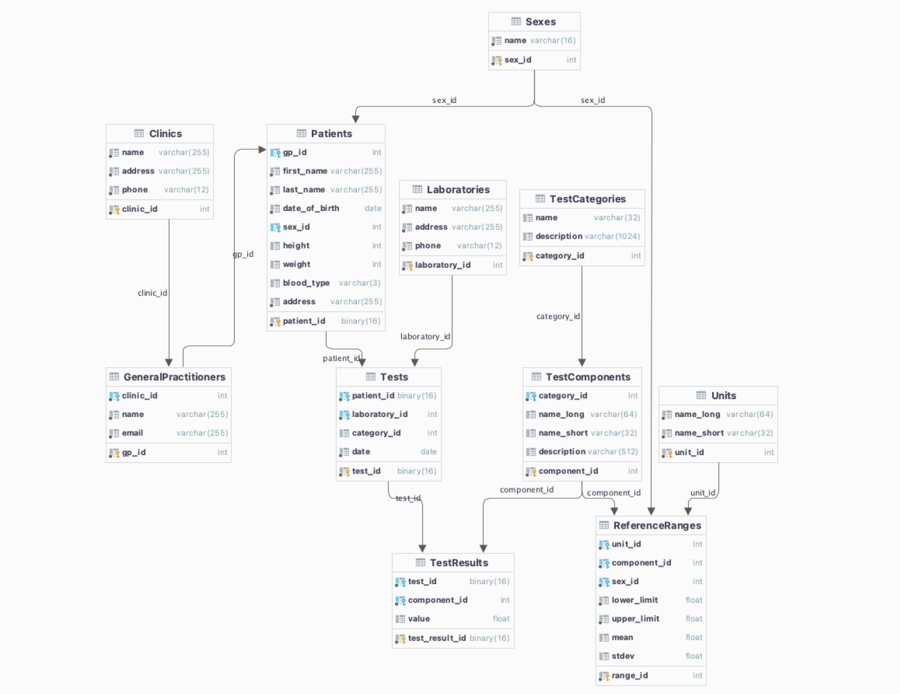

##### Motivation
The aim of this study was to understand citizen’s opinions on receiving granular data from laboratory investigation results. This was achieved through the use of an interactive application as a medium, providing participants with a visual prototype of what they could expect if provided with an electronic health record (EHR) platform that displays these laboratory test results.

##### System Architecture
###### Front-End
The front-end was implemented using React.js as a framework. The modularity of the framework and reusability of components, alongside tools such as hooks, states, and contexts proved immensely useful in the storage and updating of user data.

###### Back-End

For the back-end, Amazon Web Services (AWS) was used as the cloud provider of choice due to the modularity, flexibility, and security of the platform. The AWS services used included Relational Database Service (RDS), Lambda, IAM, Amplify, alongside various utilities such as VPC, API Gateway, and Secrets Manager.

